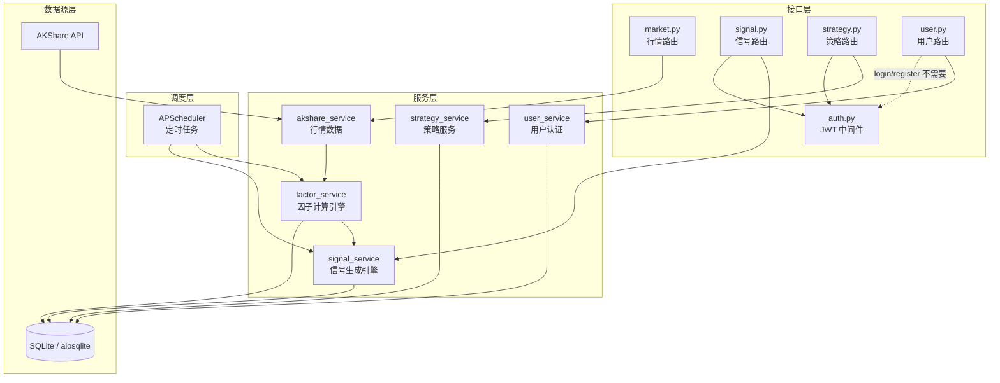
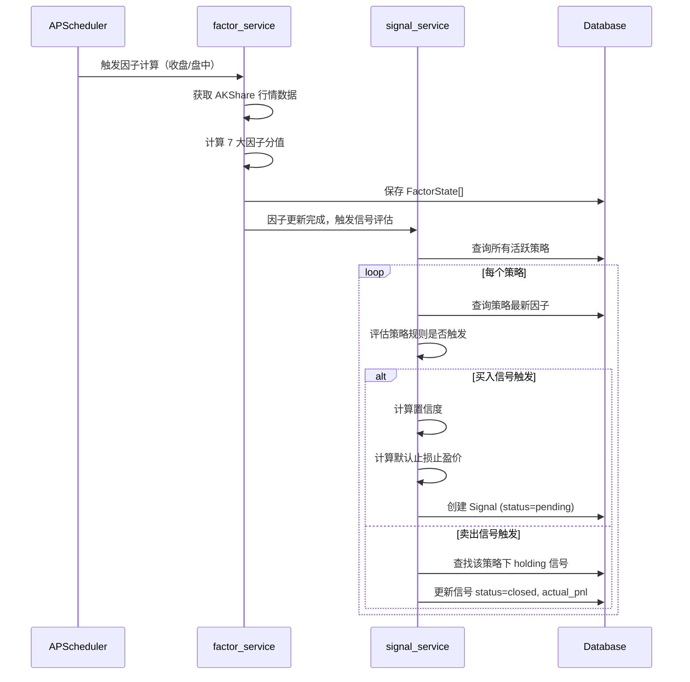
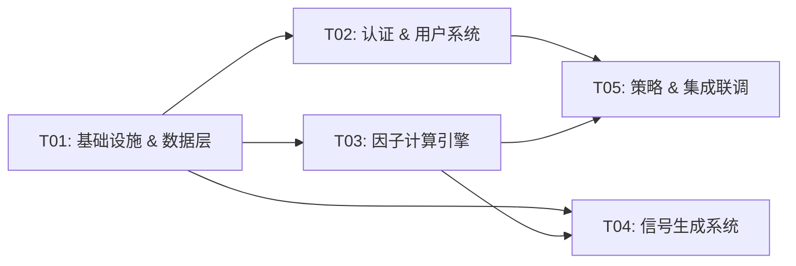

# AI 交易大师 P0 系统架构设计

> 项目：ai-trader | 版本：v1.0 | 日期：2026-06-01 | 作者：高见远（Gao）· 架构师

---

## 1. 技术选型

### 1.1 核心框架

| 层次 | 技术 | 版本 | 说明 |
|------|------|------|------|
| Web 框架 | FastAPI | ≥0.115.0 | 已有，保持 |
| ASGI | Uvicorn | ≥0.34.0 | 已有，保持 |
| ORM | SQLAlchemy (async) | ≥2.0.0 | 异步 ORM，后续迁移 PostgreSQL 无需改代码 |
| 异步驱动 | aiosqlite | ≥0.20.0 | SQLite 异步驱动，MVP 阶段使用 |
| 数据库迁移 | Alembic | ≥1.13.0 | 版本化 Schema 管理 |
| 定时任务 | APScheduler | ≥3.10.0 | 因子计算收盘后批量 + 盘中增量扫描 |

### 1.2 认证 & 安全

| 技术 | 版本 | 说明 |
|------|------|------|
| PyJWT | ≥2.8.0 | JWT Token 签发与校验 |
| python-jose | ≥3.3.0 | JWT 编解码（兼容性好） |
| passlib | ≥1.7.4 | 密码哈希（预留，验证码模式暂不用） |

### 1.3 数据源

| 技术 | 版本 | 说明 |
|------|------|------|
| AKShare | ≥1.16.0 | 已有，因子计算依赖 `stock_a_indicator_lg`、`stock_zh_a_hist` 等 |
| pandas | ≥2.0.0 | 已有，数据清洗 |
| numpy | ≥1.24.0 | 已有，数值计算 |

### 1.4 选型理由

- **SQLAlchemy async + aiosqlite**：MVP 用 SQLite 零运维，async 接口后续切 PostgreSQL 只改连接串
- **APScheduler**：轻量级定时任务，无需引入 Celery/Redis，单进程内即可调度收盘后批量因子计算和盘中增量扫描
- **python-jose**：比 PyJWT 单独使用更方便（内置 JWT + JWS + JWE），且社区维护活跃
- **Alembic**：SQLAlchemy 官方迁移工具，自动生成迁移脚本

---

## 2. 目录结构

在现有 `backend/` 基础上扩展，**不改动已有文件逻辑**：

```
backend/
├── main.py                          # [修改] 注册新路由、启动事件、生命周期
├── run.py                           # [不变]
├── requirements.txt                 # [修改] 新增依赖
├── Dockerfile                       # [不变]
├── docker-compose.yml               # [不变]
├── alembic.ini                      # [新增] Alembic 配置
├── alembic/                         # [新增] 数据库迁移目录
│   ├── env.py
│   ├── script.py.mako
│   └── versions/
│       └── 001_initial_schema.py
├── database.py                      # [新增] 数据库连接、Session 管理
├── config.py                        # [新增] 全局配置（密钥、DB 路径、JWT 参数）
├── routers/
│   ├── __init__.py                  # [不变]
│   ├── market.py                    # [不变] 已有行情路由
│   ├── signal.py                    # [新增] 信号路由（8 端点）
│   ├── strategy.py                  # [新增] 策略路由（5 端点）
│   └── user.py                      # [新增] 用户路由（4 端点 P0）
├── models/                          # [新增] SQLAlchemy ORM 模型
│   ├── __init__.py
│   ├── base.py                      # 基类（id、created_at、updated_at）
│   ├── user.py                      # User, UserAlertSettings, UserWatchlist, Notification
│   ├── strategy.py                  # Strategy, UserSubscription
│   ├── signal.py                    # Signal
│   └── factor.py                    # FactorState
├── schemas/                         # [新增] Pydantic 请求/响应模型
│   ├── __init__.py
│   ├── common.py                    # 统一响应包装、分页、错误码
│   ├── user.py                      # LoginRequest, RegisterRequest, LoginResponse, UserOut
│   ├── strategy.py                  # StrategyOut, FactorStateOut, PerformanceOut
│   └── signal.py                    # SignalOut, AlertSettingIn, LiveSignalFilter, LiveSignalStats
├── services/
│   ├── __init__.py                  # [不变]
│   ├── akshare_service.py           # [不变] 已有行情数据服务
│   ├── cache_service.py             # [不变] 已有内存缓存
│   ├── factor_service.py            # [新增] 因子计算引擎
│   ├── signal_service.py            # [新增] 信号生成引擎
│   ├── user_service.py              # [新增] 用户服务（注册/登录/Token）
│   └── strategy_service.py          # [新增] 策略服务（列表/绩效/订阅）
├── middleware/
│   ├── __init__.py                  # [新增]
│   └── auth.py                      # [新增] JWT 认证中间件 + 权限校验
└── scheduler/
    ├── __init__.py                  # [新增]
    └── jobs.py                      # [新增] APScheduler 定时任务定义
```

**文件统计**：新增 22 个文件，修改 2 个文件（main.py、requirements.txt）

---

## 3. 模块依赖图（数据流）



**数据流核心路径**：AKShare 行情 → 因子计算引擎 → 信号生成引擎 → API 路由 → 前端

---

## 4. 数据库 Schema（SQLAlchemy 模型定义）

### 4.1 基类 — `models/base.py`

```python
import uuid
from datetime import datetime
from sqlalchemy import String, DateTime, func
from sqlalchemy.orm import DeclarativeBase, Mapped, mapped_column

class Base(DeclarativeBase):
    pass

class TimestampMixin:
    created_at: Mapped[datetime] = mapped_column(DateTime, server_default=func.now())
    updated_at: Mapped[datetime] = mapped_column(DateTime, server_default=func.now(), onupdate=func.now())

def generate_uuid() -> str:
    return str(uuid.uuid4())
```

### 4.2 User 模型 — `models/user.py`

```python
class User(Base, TimestampMixin):
    __tablename__ = "users"

    id: Mapped[str] = mapped_column(String(36), primary_key=True, default=generate_uuid)
    phone: Mapped[str] = mapped_column(String(11), unique=True, nullable=False)
    nickname: Mapped[str] = mapped_column(String(50), nullable=False)
    avatar: Mapped[str] = mapped_column(String(255), default="")
    plan: Mapped[str] = mapped_column(String(20), default="free")       # free/pro/flagship
    plan_expires_at: Mapped[datetime | None] = mapped_column(DateTime, nullable=True)
    auto_renew: Mapped[bool] = mapped_column(default=False)

    # 关系
    alert_settings: Mapped["UserAlertSettings | None"] = mapped_column(back_populates="user")
    subscriptions: Mapped[list["UserSubscription"]] = mapped_column(back_populates="user")
    watchlist: Mapped[list["UserWatchlist"]] = mapped_column(back_populates="user")
    notifications: Mapped[list["Notification"]] = mapped_column(back_populates="user")

class UserAlertSettings(Base):
    __tablename__ = "user_alert_settings"

    id: Mapped[int] = mapped_column(primary_key=True, autoincrement=True)
    user_id: Mapped[str] = mapped_column(String(36), ForeignKey("users.id"), unique=True)
    stop_loss_pct: Mapped[float] = mapped_column(default=-5.0)
    take_profit_pct: Mapped[float] = mapped_column(default=10.0)
    alert_method: Mapped[str] = mapped_column(String(20), default="notification")  # notification/sms/wechat
    alert_frequency: Mapped[str] = mapped_column(String(20), default="once")       # once/daily/every

    user: Mapped["User"] = mapped_column(back_populates="alert_settings")

class UserWatchlist(Base):
    __tablename__ = "user_watchlist"

    id: Mapped[int] = mapped_column(primary_key=True, autoincrement=True)
    user_id: Mapped[str] = mapped_column(String(36), ForeignKey("users.id"))
    stock_code: Mapped[str] = mapped_column(String(10))
    added_at: Mapped[datetime] = mapped_column(DateTime, server_default=func.now())

    user: Mapped["User"] = mapped_column(back_populates="watchlist")

class Notification(Base):
    __tablename__ = "notifications"

    id: Mapped[str] = mapped_column(String(36), primary_key=True, default=generate_uuid)
    user_id: Mapped[str] = mapped_column(String(36), ForeignKey("users.id"))
    type: Mapped[str] = mapped_column(String(20))   # signal/system/expiry
    title: Mapped[str] = mapped_column(String(200))
    content: Mapped[str] = mapped_column(Text, default="")
    read: Mapped[bool] = mapped_column(default=False)
    created_at: Mapped[datetime] = mapped_column(DateTime, server_default=func.now())

    user: Mapped["User"] = mapped_column(back_populates="notifications")
```

### 4.3 Strategy 模型 — `models/strategy.py`

```python
class Strategy(Base, TimestampMixin):
    __tablename__ = "strategies"

    id: Mapped[str] = mapped_column(String(36), primary_key=True, default=generate_uuid)
    name: Mapped[str] = mapped_column(String(100), nullable=False)
    type: Mapped[str] = mapped_column(String(20), nullable=False)       # 低吸/趋势/突破/均值回归
    description: Mapped[str] = mapped_column(Text, default="")
    total_return: Mapped[float] = mapped_column(default=0.0)
    win_rate: Mapped[float] = mapped_column(default=0.0)
    max_drawdown: Mapped[float] = mapped_column(default=0.0)
    sharpe_ratio: Mapped[float] = mapped_column(default=0.0)
    sortino_ratio: Mapped[float] = mapped_column(default=0.0)
    calmar_ratio: Mapped[float] = mapped_column(default=0.0)
    running_days: Mapped[int] = mapped_column(default=0)
    signal_count: Mapped[int] = mapped_column(default=0)
    required_plan: Mapped[str] = mapped_column(String(20), default="free")  # free/pro/flagship
    is_active: Mapped[bool] = mapped_column(default=True)

    # 关系
    signals: Mapped[list["Signal"]] = mapped_column(back_populates="strategy")
    factor_states: Mapped[list["FactorState"]] = mapped_column(back_populates="strategy")
    subscriptions: Mapped[list["UserSubscription"]] = mapped_column(back_populates="strategy")

class UserSubscription(Base):
    __tablename__ = "user_subscriptions"

    id: Mapped[str] = mapped_column(String(36), primary_key=True, default=generate_uuid)
    user_id: Mapped[str] = mapped_column(String(36), ForeignKey("users.id"))
    strategy_id: Mapped[str] = mapped_column(String(36), ForeignKey("strategies.id"))
    subscribed_at: Mapped[datetime] = mapped_column(DateTime, server_default=func.now())

    user: Mapped["User"] = mapped_column(back_populates="subscriptions")
    strategy: Mapped["Strategy"] = mapped_column(back_populates="subscriptions")
```

### 4.4 Signal 模型 — `models/signal.py`

```python
class Signal(Base, TimestampMixin):
    __tablename__ = "signals"

    id: Mapped[str] = mapped_column(String(36), primary_key=True, default=generate_uuid)
    stock_code: Mapped[str] = mapped_column(String(10), nullable=False)
    stock_name: Mapped[str] = mapped_column(String(50), nullable=False)
    signal_type: Mapped[str] = mapped_column(String(10), nullable=False)   # BUY/SELL
    strategy_id: Mapped[str] = mapped_column(String(36), ForeignKey("strategies.id"))
    signal_time: Mapped[datetime] = mapped_column(DateTime, nullable=False)
    signal_price: Mapped[float] = mapped_column(nullable=False)
    mode: Mapped[str] = mapped_column(String(20), nullable=False)          # 低吸/趋势/突破/均值回归
    confidence: Mapped[int] = mapped_column(default=0)                      # 0-100
    status: Mapped[str] = mapped_column(String(20), default="pending")     # pending/executed/ignored/expired/closed
    stop_loss_price: Mapped[float | None] = mapped_column(nullable=True)
    take_profit_price: Mapped[float | None] = mapped_column(nullable=True)
    alert_status: Mapped[str] = mapped_column(String(20), default="safe")  # safe/warning/stop_loss/take_profit
    actual_pnl: Mapped[float | None] = mapped_column(nullable=True)

    # 关系
    strategy: Mapped["Strategy"] = mapped_column(back_populates="signals")
```

### 4.5 FactorState 模型 — `models/factor.py`

```python
class FactorState(Base):
    __tablename__ = "factor_states"

    id: Mapped[int] = mapped_column(primary_key=True, autoincrement=True)
    strategy_id: Mapped[str] = mapped_column(String(36), ForeignKey("strategies.id"))
    label: Mapped[str] = mapped_column(String(20), nullable=False)  # 7大因子标签
    value: Mapped[float] = mapped_column(default=0.0)               # 0-100
    change: Mapped[float] = mapped_column(default=0.0)              # 较上次变化
    status: Mapped[str] = mapped_column(String(20), default="normal")  # normal/warning/danger
    calculated_at: Mapped[datetime] = mapped_column(DateTime, server_default=func.now())

    strategy: Mapped["Strategy"] = mapped_column(back_populates="factor_states")
```

### 4.6 ER 关系图

```mermaid
erDiagram
    users ||--o{ signals : "可见信号"
    users ||--o{ user_subscriptions : "订阅"
    users ||--|| user_alert_settings : "预警设置"
    users ||--o{ user_watchlist : "自选"
    users ||--o{ notifications : "通知"
    strategies ||--o{ signals : "产出信号"
    strategies ||--o{ factor_states : "因子状态"
    strategies ||--o{ user_subscriptions : "被订阅"

    users {
        string id PK
        string phone UK
        string nickname
        string avatar
        string plan
        datetime plan_expires_at
        boolean auto_renew
        datetime created_at
        datetime updated_at
    }

    strategies {
        string id PK
        string name
        string type
        string description
        float total_return
        float win_rate
        float max_drawdown
        float sharpe_ratio
        float sortino_ratio
        float calmar_ratio
        int running_days
        int signal_count
        string required_plan
        boolean is_active
        datetime created_at
        datetime updated_at
    }

    signals {
        string id PK
        string stock_code
        string stock_name
        string signal_type
        string strategy_id FK
        datetime signal_time
        float signal_price
        string mode
        int confidence
        string status
        float stop_loss_price
        float take_profit_price
        string alert_status
        float actual_pnl
        datetime created_at
        datetime updated_at
    }

    factor_states {
        int id PK
        string strategy_id FK
        string label
        float value
        float change
        string status
        datetime calculated_at
    }

    user_subscriptions {
        string id PK
        string user_id FK
        string strategy_id FK
        datetime subscribed_at
    }

    user_alert_settings {
        int id PK
        string user_id FK_UK
        float stop_loss_pct
        float take_profit_pct
        string alert_method
        string alert_frequency
    }

    user_watchlist {
        int id PK
        string user_id FK
        string stock_code
        datetime added_at
    }

    notifications {
        string id PK
        string user_id FK
        string type
        string title
        string content
        boolean read
        datetime created_at
    }
```

---

## 5. API 接口设计

### 5.1 统一响应格式

与前端 `api.ts` 拦截器完全对齐：

```python
# schemas/common.py
from pydantic import BaseModel
from typing import TypeVar, Generic, Optional

T = TypeVar("T")

class ApiResponse(BaseModel, Generic[T]):
    code: int = 0
    data: Optional[T] = None
    message: str = "ok"
```

### 5.2 错误码定义

| 错误码 | 含义 | HTTP 状态码 |
|--------|------|-------------|
| 0 | 成功 | 200 |
| 401 | 未认证 / Token 过期 | 401 |
| 403 | 权限不足（会员等级不够） | 403 |
| 404 | 资源不存在 | 404 |
| 1001 | 验证码错误 | 400 |
| 1002 | 手机号已注册 | 409 |
| 1003 | 手机号未注册 | 404 |
| 1004 | Token 刷新失败 | 401 |
| 2001 | 策略不存在 | 404 |
| 2002 | 已订阅该策略 | 409 |
| 3001 | 信号不存在 | 404 |
| 3002 | 信号状态不允许操作 | 400 |
| 3003 | Free 用户每日信号上限 | 403 |
| 9999 | 服务器内部错误 | 500 |

### 5.3 认证要求

| 端点 | 需要 JWT | 说明 |
|------|---------|------|
| `POST /api/user/send-code` | ❌ | 公开 |
| `POST /api/user/register` | ❌ | 公开 |
| `POST /api/user/login` | ❌ | 公开 |
| `POST /api/user/refresh-token` | ❌ | 公开（需 Refresh Token） |
| `GET /api/signals/timing` | ✅ | 需登录 |
| `GET /api/signals/emotion1` | ✅ | 需登录 |
| `GET /api/signals/emotion2` | ✅ | 需登录 |
| `GET /api/signals/live` | ✅ | 需登录 |
| `GET /api/signals/live/stats` | ✅ | 需登录 |
| `POST /api/signals/:id/execute` | ✅ | 需登录 |
| `POST /api/signals/:id/ignore` | ✅ | 需登录 |
| `PUT /api/signals/:id/alert` | ✅ | 需登录 |
| `GET /api/strategies` | ✅ | 需登录 |
| `GET /api/strategies/:id` | ✅ | 需登录 |
| `GET /api/strategies/:id/performance` | ✅ | 需登录 |
| `POST /api/strategies/:id/subscribe` | ✅ | 需登录 + 权限检查 |
| `GET /api/strategies/:id/factors` | ✅ | 需登录 |

### 5.4 Pydantic Schema 详细定义

#### 用户相关 — `schemas/user.py`

```python
class SendCodeRequest(BaseModel):
    phone: str  # 11位手机号

class RegisterRequest(BaseModel):
    phone: str
    code: str       # 验证码
    nickname: str

class LoginRequest(BaseModel):
    phone: str
    code: str

class LoginResponse(BaseModel):
    token: str          # access_token
    refresh_token: str  # refresh_token
    user: "UserOut"

class UserOut(BaseModel):
    id: str
    phone: str
    nickname: str
    avatar: str
    plan: str           # free/pro/flagship
    plan_expires_at: str | None
    auto_renew: bool

class RefreshTokenRequest(BaseModel):
    refresh_token: str
```

#### 信号相关 — `schemas/signal.py`

```python
class SignalOut(BaseModel):
    id: str
    stock_code: str
    stock_name: str
    signal_type: str        # BUY/SELL
    strategy_id: str
    signal_time: str
    signal_price: float
    mode: str               # 低吸/趋势/突破/均值回归
    confidence: int
    status: str
    stop_loss_price: float | None
    take_profit_price: float | None
    alert_status: str
    actual_pnl: float | None
    holding_days: int | None = None
    current_price: float | None = None
    floating_pnl: float | None = None

class AlertSettingIn(BaseModel):
    stop_loss_price: float
    take_profit_price: float
    alert_method: str = "notification"      # notification/sms/wechat
    alert_frequency: str = "once"           # once/daily/every

class LiveSignalFilter(BaseModel):
    type: str = "all"           # all/BUY/SELL
    period: str = "today"       # today/week/month
    search: str | None = None
    onlyHolding: bool = False
    onlyAlerting: bool = False

class LiveSignalStatsOut(BaseModel):
    today_count: int
    holding: int
    take_profit: int
    stop_loss: int
    alerting: int

class EmotionDataOut(BaseModel):
    date: str
    value: float

class EmotionFlowDataOut(BaseModel):
    date: str
    inflow: float
    outflow: float
```

#### 策略相关 — `schemas/strategy.py`

```python
class StrategyOut(BaseModel):
    id: str
    name: str
    type: str
    description: str
    total_return: float
    win_rate: float
    max_drawdown: float
    sharpe_ratio: float
    sortino_ratio: float
    calmar_ratio: float
    running_days: int
    signal_count: int
    required_plan: str
    is_subscribed: bool = False

class FactorStateOut(BaseModel):
    label: str
    value: float
    change: float
    status: str   # normal/warning/danger

class PerformanceOut(BaseModel):
    dates: list[str]
    strategy_values: list[float]
    benchmark_values: list[float]
    total_return: float
    max_drawdown: float
    sharpe_ratio: float
    trades: list[dict]   # TradeDetail[]
```

---

## 6. 因子计算逻辑详细设计

### 6.1 数据获取

因子计算依赖 AKShare 已有接口 + 新增接口：

| 因子 | AKShare 接口 | 数据说明 |
|------|-------------|---------|
| 估值优势 | `stock_a_indicator_lg(symbol)` | PE/PB 历史数据 |
| 涨势动力 | `stock_zh_a_hist(symbol, period="daily")` | 日 K（收盘价 → MA/MACD） |
| 资金热度 | `stock_individual_fund_flow(stock, market)` | 主力净流入占比 + 换手率 |
| 反弹潜力 | `stock_zh_a_hist(symbol, period="daily")` | 日 K 高点 |
| 市场温度 | `stock_zh_a_spot_em()` | 全市场上涨/下跌/涨停家数 |
| 震荡程度 | `stock_zh_a_hist(symbol, period="daily")` | ATR / 布林带 |
| 突破强度 | `stock_zh_a_hist(symbol, period="daily")` | 收盘价 vs 布林上轨/前高 + 量比 |

### 6.2 各因子计算公式（伪代码）

#### 因子 1：估值优势 (valuation_score)

```python
def calc_valuation(stock_code: str) -> float:
    """估值优势：PE/PB 分位数越低分越高"""
    # 1. 获取近 250 日 PE/PB
    df = akshare.stock_a_indicator_lg(symbol=stock_code.split(".")[0])
    pe_series = df["pe"][-250:]
    pb_series = df["pb"][-250:]

    # 2. 计算当前值在 250 日中的分位数
    pe_percentile = percentile_rank(pe_series, current_pe)  # 0-100，越高表示越贵
    pb_percentile = percentile_rank(pb_series, current_pb)

    # 3. 分位数越低 → 估值越低 → 得分越高（反转）
    #    PE 分位 20% → 得分 80；PE 分位 80% → 得分 20
    pe_score = 100 - pe_percentile
    pb_score = 100 - pb_percentile

    # 4. 加权合并（PE 权重 0.6，PB 权重 0.4）
    score = 0.6 * pe_score + 0.4 * pb_score
    return clamp(score, 0, 100)

def percentile_rank(series, value):
    """计算 value 在 series 中的百分位排名"""
    return (series < value).sum() / len(series) * 100
```

#### 因子 2：涨势动力 (momentum_score)

```python
def calc_momentum(stock_code: str) -> float:
    """涨势动力：均线多头排列 + MACD 金叉"""
    kline = akshare_service.get_kline(stock_code, "daily")
    closes = [k["close"] for k in kline]

    # 1. 均线计算
    ma5  = SMA(closes, 5)
    ma20 = SMA(closes, 20)
    ma60 = SMA(closes, 60)

    # 2. 均线多头排列得分
    ma_score = 0
    if ma5[-1] > ma20[-1]:
        ma_score += 30
    if ma20[-1] > ma60[-1]:
        ma_score += 30
    if ma5[-1] > ma60[-1]:
        ma_score += 20
    # 价格在 MA5 之上
    if closes[-1] > ma5[-1]:
        ma_score += 20

    # 3. MACD 金叉加分
    macd_score = 0
    dif, dea, hist = calc_macd(closes, fast=12, slow=26, signal=9)
    if dif[-1] > dea[-1]:               # DIF > DEA → 多头
        macd_score += 30
    if dif[-2] <= dea[-2] and dif[-1] > dea[-1]:  # 金叉
        macd_score += 40
    if hist[-1] > 0 and hist[-2] <= 0:  # 柱线由负转正
        macd_score += 30

    score = 0.6 * ma_score + 0.4 * macd_score
    return clamp(score, 0, 100)
```

#### 因子 3：资金热度 (capital_heat_score)

```python
def calc_capital_heat(stock_code: str) -> float:
    """资金热度：主力净流入占比 + 换手率"""
    fundflow = akshare_service.get_fund_flow(stock_code)
    quote = akshare_service.get_stock_quote(stock_code)

    main_inflow_pct = fundflow.get("main_net_inflow_pct", 0)  # -100 ~ 100
    turnover_rate = quote.get("turnover_rate", 0)              # 0 ~ 50+

    # 1. 主力净流入得分：占比映射到 0-100
    #    -20% → 0分，+20% → 100分，线性映射
    inflow_score = clamp((main_inflow_pct + 20) / 40 * 100, 0, 100)

    # 2. 换手率得分：适中偏高最佳（5-10% 区间满分）
    if turnover_rate < 1:
        turnover_score = turnover_rate * 20           # < 1% → 0-20
    elif turnover_rate <= 10:
        turnover_score = 20 + (turnover_rate - 1) * 8.9  # 1-10% → 20-100
    else:
        turnover_score = max(100 - (turnover_rate - 10) * 5, 40)  # >10% → 递减

    score = 0.6 * inflow_score + 0.4 * turnover_score
    return clamp(score, 0, 100)
```

#### 因子 4：反弹潜力 (rebound_score)

```python
def calc_rebound(stock_code: str) -> float:
    """反弹潜力：距近 60 日高点回撤幅度，回撤越深潜力越高"""
    kline = akshare_service.get_kline(stock_code, "daily")
    closes = [k["close"] for k in kline[-60:]]  # 近 60 日

    high_60 = max(closes)
    current = closes[-1]

    # 回撤幅度：0% → 未回撤 → 0分；50% → 深度回撤 → 100分
    drawdown = (high_60 - current) / high_60 * 100

    # 线性映射：0% 回撤 → 0分，50% 回撤 → 100分
    score = clamp(drawdown / 50 * 100, 0, 100)
    return score
```

#### 因子 5：市场温度 (market_temperature_score)

```python
def calc_market_temperature() -> float:
    """市场温度：全市场上涨家数占比 + 涨停家数占比"""
    df = ak.stock_zh_a_spot_em()

    total = len(df)
    up_count = (df["涨跌幅"] > 0).sum()
    limit_up_count = (df["涨跌幅"] >= 9.9).sum()

    # 1. 上涨占比得分
    up_ratio = up_count / total * 100  # 0-100%
    up_score = up_ratio  # 直接用百分比

    # 2. 涨停占比得分：涨停占比 0% → 0分，3%+ → 100分
    limit_ratio = limit_up_count / total * 100
    limit_score = clamp(limit_ratio / 3 * 100, 0, 100)

    score = 0.7 * up_score + 0.3 * limit_score
    return clamp(score, 0, 100)
```

#### 因子 6：震荡程度 (volatility_score)

```python
def calc_volatility(stock_code: str) -> float:
    """震荡程度：ATR(14)/Close 标准化 + 布林带宽度"""
    kline = akshare_service.get_kline(stock_code, "daily")
    closes = [k["close"] for k in kline]
    highs = [k["high"] for k in kline]
    lows = [k["low"] for k in kline]

    # 1. ATR(14)
    atr = calc_atr(highs, lows, closes, period=14)
    atr_pct = atr[-1] / closes[-1] * 100  # 标准化到百分比

    # ATR% 映射：0% → 0分，8%+ → 100分
    atr_score = clamp(atr_pct / 8 * 100, 0, 100)

    # 2. 布林带宽度 = (Upper - Lower) / Middle
    upper, middle, lower = calc_bollinger(closes, period=20, std_dev=2)
    bb_width = (upper[-1] - lower[-1]) / middle[-1] * 100

    # BB 宽度映射：0% → 0分，15%+ → 100分
    bb_score = clamp(bb_width / 15 * 100, 0, 100)

    score = 0.6 * atr_score + 0.4 * bb_score
    return clamp(score, 0, 100)
```

#### 因子 7：突破强度 (breakout_score)

```python
def calc_breakout(stock_code: str) -> float:
    """突破强度：收盘价突破布林上轨/前高 + 成交量放大"""
    kline = akshare_service.get_kline(stock_code, "daily")
    closes = [k["close"] for k in kline]
    volumes = [k["volume"] for k in kline]

    # 1. 布林带突破
    upper, middle, lower = calc_bollinger(closes, period=20, std_dev=2)
    if closes[-1] > upper[-1]:
        bb_break_score = 100  # 突破上轨
    elif closes[-1] > middle[-1]:
        bb_break_score = 60   # 在中轨上方
    else:
        bb_break_score = 20   # 在中轨下方

    # 2. 前高突破
    high_20 = max(closes[-21:-1])  # 前 20 日最高
    if closes[-1] > high_20:
        prev_high_score = 100
    elif closes[-1] > high_20 * 0.97:
        prev_high_score = 60
    else:
        prev_high_score = 20

    # 3. 量比（今日成交量 / 近 5 日平均成交量）
    avg_vol_5 = sum(volumes[-6:-1]) / 5
    volume_ratio = volumes[-1] / avg_vol_5 if avg_vol_5 > 0 else 1
    # 量比映射：0.5 → 0分，3.0+ → 100分
    vol_score = clamp((volume_ratio - 0.5) / 2.5 * 100, 0, 100)

    score = 0.35 * bb_break_score + 0.35 * prev_high_score + 0.3 * vol_score
    return clamp(score, 0, 100)
```

### 6.3 因子状态判定规则

```python
def determine_factor_status(value: float, change: float) -> str:
    """
    normal:  value >= 40 且 |change| <= 5
    warning: value < 40 或 |change| > 5
    danger:  value < 20 或 |change| > 10
    """
    if value < 20 or abs(change) > 10:
        return "danger"
    elif value < 40 or abs(change) > 5:
        return "warning"
    else:
        return "normal"
```

### 6.4 因子计算调度

| 任务 | 触发时间 | Cron 表达式 | 说明 |
|------|---------|------------|------|
| 收盘后批量因子计算 | 15:30 | `30 15 * * 1-5` | 每个交易日收盘后，全量计算所有策略的因子 |
| 盘中增量因子更新 | 每 5 分钟 | `*/5 9-15 * * 1-5` | 交易时段内，增量更新因子值 |
| 信号过期检查 | 每小时 | `0 * * * *` | 将超过 24h 的 pending 信号标记为 expired |

---

## 7. 信号生成逻辑详细设计

### 7.1 信号生成完整流程



### 7.2 策略规则 → 因子匹配

```python
# 策略规则配置表
STRATEGY_RULES = {
    "低吸": {
        "buy_conditions": {
            "估值优势": (">=", 70),   # 主因子
            "反弹潜力": (">=", 60),   # 辅因子
            "市场温度": ("<", 40),    # 环境因子
        },
        "sell_conditions": {
            "浮盈": (">=", "take_profit_pct"),
            "浮亏": (">=", "stop_loss_pct"),
        },
        "weights": {
            "主因子": 0.4,     # 估值优势
            "辅因子": 0.25,    # 反弹潜力
            "资金热度": 0.2,
            "市场温度": 0.15,
        },
    },
    "趋势": {
        "buy_conditions": {
            "涨势动力": (">=", 75),   # 主因子
            "突破强度": (">=", 60),   # 辅因子
        },
        "sell_conditions": {
            "涨势动力": ("<", 30),
            "浮亏": (">=", "stop_loss_pct"),
        },
        "weights": {
            "主因子": 0.4,     # 涨势动力
            "辅因子": 0.25,    # 突破强度
            "资金热度": 0.2,
            "市场温度": 0.15,
        },
    },
    "突破": {
        "buy_conditions": {
            "突破强度": (">=", 80),   # 主因子
            "资金热度": (">=", 60),   # 辅因子
        },
        "sell_conditions": {
            "突破强度": ("<", 20),
            "浮亏": (">=", "stop_loss_pct"),
        },
        "weights": {
            "主因子": 0.4,     # 突破强度
            "辅因子": 0.25,    # 资金热度
            "资金热度": 0.2,
            "市场温度": 0.15,
        },
    },
    "均值回归": {
        "buy_conditions": {
            "震荡程度": (">=", 65),   # 主因子
            "估值优势": (">=", 50),   # 辅因子
        },
        "sell_conditions": {
            "价格回归均值": (">=", 2),  # ±2% 内
            "浮亏": (">=", "stop_loss_pct"),
        },
        "weights": {
            "主因子": 0.4,     # 震荡程度
            "辅因子": 0.25,    # 估值优势
            "资金热度": 0.2,
            "市场温度": 0.15,
        },
    },
}
```

### 7.3 置信度计算

```python
def calc_confidence(strategy_type: str, factors: dict[str, float]) -> int:
    """
    confidence = w1 * 主因子得分 + w2 * 辅因子得分 + w3 * 资金热度 + w4 * 市场温度

    所有因子得分归一化到 0-100 后加权求和
    """
    rule = STRATEGY_RULES[strategy_type]
    weights = rule["weights"]

    # 主因子：根据策略类型取对应因子
    primary_map = {
        "低吸": "估值优势",
        "趋势": "涨势动力",
        "突破": "突破强度",
        "均值回归": "震荡程度",
    }
    # 辅因子
    secondary_map = {
        "低吸": "反弹潜力",
        "趋势": "突破强度",
        "突破": "资金热度",
        "均值回归": "估值优势",
    }

    primary_factor = primary_map[strategy_type]
    secondary_factor = secondary_map[strategy_type]

    confidence = (
        weights["主因子"] * factors.get(primary_factor, 0) +
        weights["辅因子"] * factors.get(secondary_factor, 0) +
        weights["资金热度"] * factors.get("资金热度", 0) +
        weights["市场温度"] * factors.get("市场温度", 0)
    )

    return int(clamp(round(confidence), 0, 100))
```

### 7.4 止损止盈价格计算

```python
def calc_stop_loss_take_profit(signal_price: float, mode: str) -> tuple[float, float]:
    """根据策略模式计算默认止损止盈价格"""
    # 默认止损/止盈比例
    defaults = {
        "低吸":     {"stop_loss_pct": 0.05, "take_profit_pct": 0.10},
        "趋势":     {"stop_loss_pct": 0.07, "take_profit_pct": 0.15},
        "突破":     {"stop_loss_pct": 0.05, "take_profit_pct": 0.12},
        "均值回归": {"stop_loss_pct": 0.04, "take_profit_pct": 0.08},
    }

    params = defaults.get(mode, {"stop_loss_pct": 0.05, "take_profit_pct": 0.10})
    stop_loss_price = round(signal_price * (1 - params["stop_loss_pct"]), 4)
    take_profit_price = round(signal_price * (1 + params["take_profit_pct"]), 4)

    return stop_loss_price, take_profit_price
```

### 7.5 预警状态转换

```python
def update_alert_status(signal: Signal, current_price: float) -> str:
    """
    safe → warning: 浮亏 >= stop_loss_pct * 70% 或 浮盈 >= take_profit_pct * 70%
    warning → stop_loss: 浮亏 >= stop_loss_pct
    warning → take_profit: 浮盈 >= take_profit_pct
    """
    pnl_pct = (current_price - signal.signal_price) / signal.signal_price * 100

    if signal.signal_type == "BUY":
        # 买入信号：浮盈 = current > signal_price
        floating_pnl_pct = pnl_pct
        stop_loss_pct = (signal.signal_price - signal.stop_loss_price) / signal.signal_price * 100 if signal.stop_loss_price else 5
        take_profit_pct = (signal.take_profit_price - signal.signal_price) / signal.signal_price * 100 if signal.take_profit_price else 10

        if floating_pnl_pct <= -stop_loss_pct:
            return "stop_loss"
        elif floating_pnl_pct >= take_profit_pct:
            return "take_profit"
        elif floating_pnl_pct <= -stop_loss_pct * 0.7 or floating_pnl_pct >= take_profit_pct * 0.7:
            return "warning"
        else:
            return "safe"

    return signal.alert_status
```

### 7.6 信号生命周期

```
pending ──→ executed   (用户点击买入 POST /api/signals/:id/execute)
       ──→ ignored    (用户主动忽略 POST /api/signals/:id/ignore)
       ──→ expired    (24h 未确认自动过期，APScheduler 每小时检查)

executed ──→ closed    (SELL 信号触发 或 止损止盈触发)
```

---

## 8. 任务列表

| 任务 ID | 任务名 | 涉及文件 | 文件数 | 依赖 | 优先级 | 验收标准 |
|---------|--------|---------|--------|------|--------|---------|
| T01 | 项目基础设施 & 数据层 | config.py, database.py, alembic.ini, alembic/env.py, alembic/script.py.mako, alembic/versions/001_initial_schema.py, models/__init__.py, models/base.py, models/user.py, models/strategy.py, models/signal.py, models/factor.py, schemas/__init__.py, schemas/common.py, requirements.txt, main.py(修改) | 16 | 无 | P0 | `alembic upgrade head` 成功建表；`/api/health` 返回 ok；所有模型可导入 |
| T02 | 认证 & 用户系统 | middleware/__init__.py, middleware/auth.py, services/user_service.py, routers/user.py, schemas/user.py | 5 | T01 | P0 | 验证码发送/登录/注册/刷新 Token 四端点可用；JWT 中间件拦截未认证请求；401 响应正确触发前端跳转 |
| T03 | 因子计算引擎 | services/factor_service.py, services/strategy_service.py(部分), routers/strategy.py, schemas/strategy.py, scheduler/__init__.py, scheduler/jobs.py, main.py(修改:添加scheduler) | 7 | T01 | P0 | 7 大因子可独立计算并返回 0-100 分值；`GET /api/strategies/:id/factors` 返回 FactorState[]；APScheduler 定时任务注册成功 |
| T04 | 信号生成系统 | services/signal_service.py, routers/signal.py, schemas/signal.py, main.py(修改:添加路由) | 4 | T01, T03 | P0 | 因子阈值触发 → 自动创建 Signal；8 个信号端点全部可用；信号生命周期状态转换正确；Free 用户信号数量限制生效 |
| T05 | 策略 & 集成联调 | services/strategy_service.py(补全), routers/strategy.py(补全绩效/订阅), main.py(最终修改), Alembic seed data | 4 | T01, T02, T03 | P0 | 策略列表/详情/绩效/订阅端点可用；权限控制（required_plan 校验）生效；策略种子数据初始化；端到端：因子更新→信号生成→API 返回完整流程跑通 |

### 任务依赖图



---

## 9. 依赖包列表

`requirements.txt` 需新增：

```
# --- 已有 ---
fastapi>=0.115.0
uvicorn>=0.34.0
akshare>=1.16.0
pandas>=2.0.0
numpy>=1.24.0

# --- 新增 ---
sqlalchemy>=2.0.0           # 异步 ORM
aiosqlite>=0.20.0           # SQLite 异步驱动
alembic>=1.13.0             # 数据库迁移
python-jose[cryptography]>=3.3.0  # JWT 编解码
passlib>=1.7.4              # 密码哈希（预留）
apscheduler>=3.10.0         # 定时任务
pydantic>=2.0.0             # FastAPI 已内置，显式声明版本
```

---

## 10. 共享约定

### 10.1 命名规范

| 类别 | 规范 | 示例 |
|------|------|------|
| 文件名 | snake_case | `factor_service.py` |
| 类名 | PascalCase | `FactorService`, `UserOut` |
| 函数/方法 | snake_case | `calc_valuation()`, `get_factors()` |
| 常量 | UPPER_SNAKE_CASE | `STRATEGY_RULES`, `JWT_SECRET` |
| API 路径 | kebab-case（已统一小写） | `/api/signals/live/stats` |
| 数据库列 | snake_case | `stop_loss_price`, `signal_time` |

### 10.2 统一响应格式

所有 API 必须返回 `ApiResponse[T]` 格式：

```python
# 成功
{"code": 0, "data": {...}, "message": "ok"}

# 失败
{"code": 1001, "data": null, "message": "验证码错误"}
```

### 10.3 错误处理模式

```python
from fastapi import HTTPException
from schemas.common import ApiResponse

class AppException(HTTPException):
    """业务异常基类"""
    def __init__(self, code: int, message: str, status_code: int = 400):
        self.code = code
        self.message = message
        super().__init__(status_code=status_code, detail=message)

# 使用示例
raise AppException(code=1001, message="验证码错误", status_code=400)
```

全局异常处理器在 `main.py` 中注册：

```python
@app.exception_handler(AppException)
async def app_exception_handler(request, exc):
    return JSONResponse(
        status_code=exc.status_code,
        content={"code": exc.code, "data": None, "message": exc.message}
    )
```

### 10.4 日志格式

```python
import logging

# 统一使用 Python logging，格式：
# [LEVEL] [module:function] message
logging.basicConfig(
    level=logging.INFO,
    format="[%(levelname)s] [%(module)s:%(funcName)s] %(message)s"
)
```

### 10.5 数据库 Session 管理

```python
# database.py 中使用 async sessionmaker + 依赖注入
from sqlalchemy.ext.asyncio import create_async_engine, async_sessionmaker, AsyncSession
from fastapi import Depends

engine = create_async_engine("sqlite+aiosqlite:///./ai_trader.db")
async_session = async_sessionmaker(engine, expire_on_commit=False)

async def get_db() -> AsyncSession:
    async with async_session() as session:
        yield session

# 路由中使用
@router.get("/signals/live")
async def get_live_signals(db: AsyncSession = Depends(get_db), user=Depends(get_current_user)):
    ...
```

### 10.6 JWT 约定

| 项目 | 值 |
|------|------|
| Access Token 有效期 | 2 小时 |
| Refresh Token 有效期 | 30 天 |
| Token 签发算法 | HS256 |
| Access Token payload | `{user_id, phone, plan, exp}` |
| Refresh Token payload | `{user_id, type: "refresh", exp}` |
| 请求头 | `Authorization: Bearer <access_token>` |

### 10.7 日期时间

- 所有 datetime 存储为 **UTC**（SQLite 无时区，约定存 UTC）
- API 传输使用 **ISO 8601** 格式：`2026-06-01T15:30:00Z`
- 前端负责时区转换显示

### 10.8 权限等级比较

```python
PLAN_LEVELS = {"free": 0, "pro": 1, "flagship": 2}

def has_permission(user_plan: str, required_plan: str) -> bool:
    return PLAN_LEVELS.get(user_plan, 0) >= PLAN_LEVELS.get(required_plan, 0)
```

### 10.9 Free 用户信号限制

```python
FREE_DAILY_SIGNAL_LIMIT = 3

async def check_signal_limit(user: User, db: AsyncSession) -> bool:
    """Free 用户每日信号上限检查"""
    if user.plan != "free":
        return True  # Pro/Flagship 不限
    today = date.today()
    count = await db.scalar(
        select(func.count(Signal.id)).where(
            Signal.created_at >= today,
            # 仅限用户已订阅策略的信号
        )
    )
    return count < FREE_DAILY_SIGNAL_LIMIT
```

---

## 11. 不确定事项 & 假设

| # | 事项 | 当前假设 | 风险 |
|---|------|---------|------|
| 1 | AKShare `stock_a_indicator_lg` 数据延迟 | 假设 T+1 可用（前一交易日数据） | 若实时不可用，估值因子需降级为昨日数据 |
| 2 | 信号对用户可见规则 | 仅用户已订阅策略的信号可见 | 需在 signal_service 中 join user_subscriptions |
| 3 | 策略种子数据 | 硬编码 4 个默认策略（低吸/趋势/突破/均值回归） | 后续需管理后台 |
| 4 | 信号中的 user_id | P0 中信号为系统级（不绑定单个用户），可见性通过订阅关系过滤 | 后续需支持用户个性化信号 |
| 5 | 因子增量更新 | 盘中每 5 分钟全量重算（无增量逻辑） | MVP 可接受，后续可优化为增量 |
| 6 | SQLite 并发 | aiosqlite 单写多读，MVP 足够 | 后续迁移 PostgreSQL 时需注意 |
